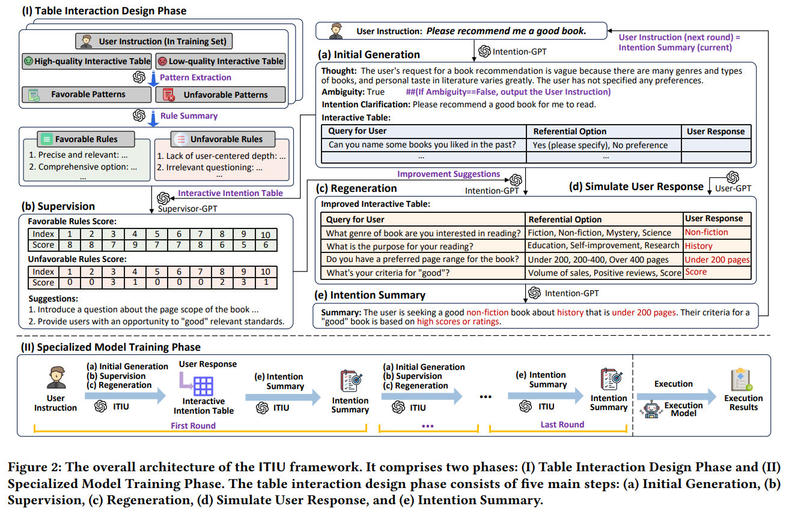
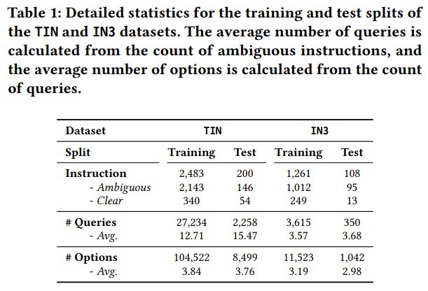
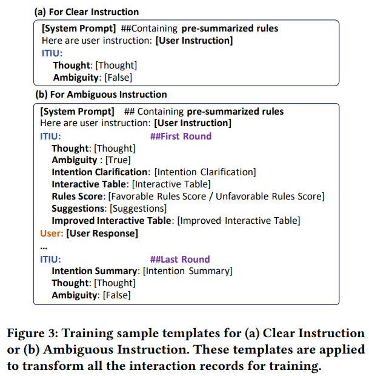
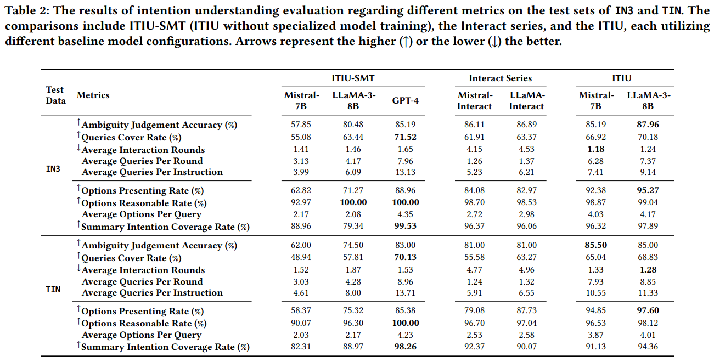
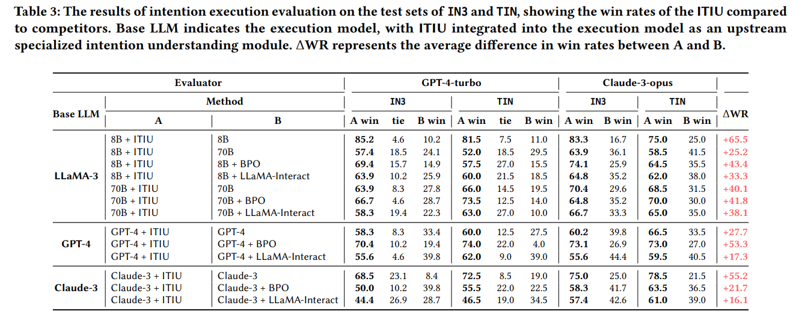
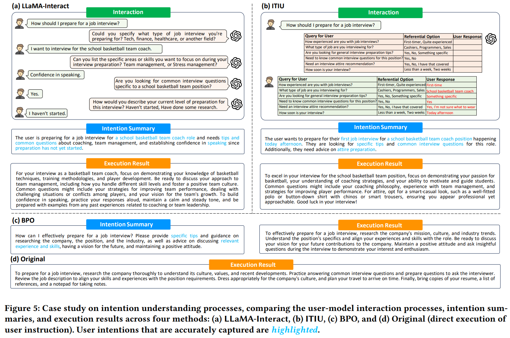

<div align="center">
    <h1>   ITIU: Intention Understanding via Interactive Table in Large Language Models</h1>
</div>

<p align="center">

</p>


The repo is for the implementation and evaluation of ITIU, a powerful framework for intention understanding in LLMs. Source codes and datasets for **ITIU: Intention Understanding via Interactive Table in Large Language Models**. We release TIN dataset and develop ITIU, capable of discerning ambiguous user instructions and recovering missing intentions.


<div><a id="Contributions"></a></div>

## 🌟Contributions

- To the best of our knowledge, we are among the first to comprehensively identify the main challenges of intention understanding in LLMs and propose a non-trivial solution.
- We introduce the idea of non-linear thinking and propose a novel framework ITIU for intention understanding, comprising two innovative phases——table interacting design and specialized model training.
- Extensive experiments demonstrate the feasibility and effectiveness of our method in intention understanding and intention execution evaluations, particularly in terms of efficiency and accuracy, thereby promoting a new paradigm in intention understanding within LLMs.
<div><a id="Citation"></a></div>


<div><a id="Introduction"></a></div>

## 📖 Introduction

### Interative Table-based Intention Understanding (ITIU) Framework

we propose a novel interactive table-based intention understanding (ITIU) framework for LLMs, where an intention table is constructed to efficiently comprehend and interact with users to achieve their genuine goals. Additionally, a rule-based supervision mechanism is designed to enhance the precision of the contents.


<div align="center">
    
    <br/>
</div>


- ITIU consists of two pahses: **(I) Table Interaction Design Phase** and **(II) Specialized Model Training Phase**. 
- The table interaction design phase comprises five key steps. The process begins with **(a) Initial Generation Step**, wherein Intention-GPT (GPT-4) judges the ambiguity of user instructions. Clear instructions are directly outputted, while ambiguous instructions lead to the generation of intention clarification and an interactive table. 
- During **(b) Supervision Step**, Supervisor-GPT (another GPT-4) evaluates the interactive table against pre-summarized rules and offers constructive suggestions to refine the accuracy of intention understanding.  
- Following these suggestions, Intention-GPT regenerates the interactive table in **(c) Regeneration Step**.  
- In **(d) Simulate User Response Step**, User-GPT (a third GPT-4) simulates user responses.  
- Finally, in **(e) Intention Summary Step**, Intention-GPT summarizes the useru intentions from their responses within the interactive table.  This summary serves as the user instruction for the next round, continuing until Intention-GPT judges the instructions clear.

### Process

- **Table Interaction Design Phase**: We design the process of table interaction and obtain an initial interaction record using GPT-4.
- **Specialized Model Training Phase**: Refer to initial interaction records, we manually label the TIN data set specifically for training LLaMA-3-8B-Instruct into a specialized intention understanding interaction model.

### Prompts
- All prompts for this project can be found in `./all_prompt.txt`.

<div><a id="Training"></a></div>

## 🛠️ Table Interaction Design Phase

### Rule Summarization


- Pattern Extraction
```shell
python ./patterns.py
```

- Rule Summary
```shell
python ./favorable_summary.py
python ./unfavorable_summary.py
```


### Get interaction record
- We employ three GPT-4 (GPT-4-turbo-2024-04-09) to simulate the interaction, with one imitating the user aiming to complete a certain task (**User-GPT**), another as an assistant aiming to clearly understand user intentions (**Assistant-GPT**), a third as an supervisor to ensuer the quality of iterative table contents (**Supervisor-GPT**).


```shell
python ./intention_understanding.py
```


## 🛠️ Specialized Model Training Phase


### Construction of Training Data
We manually annotate the preliminary interaction records to form the TIN dataset and put it under `./data/TIN`. 

<div align="center">
    
    <br/>

</div>

Then we convert the training set of TIN to training data according to the training data conversion template:

<div align="center">
    
    <br/>
</div>

```shell
python ./training_sample_template.py
```

### Training

We utilize the Transformers framework to conduct full-parameter fine-tuning of LLaMA-3-8B-Instruct on two 80GB A100. 
Specific hyper-parameters can be tuned in `scripts/sft.sh`. Here are some parameters need to check:

- `model_name_or_path`: Path to the Mistral-7B-v0.1 base model weights. Note that the weights should be transformed from huggingface weight to bmtrain weight using the script provided **[here](https://github.com/OpenBMB/ModelCenter/blob/main/transfer/hugLLaMa2_bmtrainLLaMa2.py).**
- `data_dir`: Path to the training data with conversation records.
- `save_dir`: Path to the saved checkpoints.

```shell
python training/train.py
```


## 📊 Evaluation

To comprehensively evaluate the effectiveness of ITIU, we structure our experiments into two parts:
(1) **Intention Understanding**, which assesses the target model's ability to understand user intentions during interactions;
(2) **Intention Execution**, which evaluates the performance of downstream LLMs in executing tasks following user-model interactions.

### Intention Understanding

Intention understanding evaluation does not involve the any execution of tasks. We directly assess the target model itself during interactions to evaluate its capability as an upstream intention understanding module.

#### Metrics

- **Vagueness Judgment Accuracy**: This metric calculates the percentage of the model's instruction ambiguity judgments   that align with the ground truth. 
- **Queries Cover Rate**: FIt measures the percentage of underlying fact queries that are covered by queries generated by the model during the interaction.
- **Average Interaction Rounds**: It calculates the average number of interaction rounds per instruction. 
- **Average Queries Per Round**: This metric determines the average number of queries per round of interaction.
- **Average Queries Per Instruction**: This measures the average number of queries the model inquires about per instruction.
- **Options Presenting Rate**: This metric evaluates the percentage of the queries accompanied by potential referential options.
- **Options Reasonable Rate**: It records the percentage of referential options provided by the model that are considered reasonable.
- **Average Options Per Query**: This represents the average number of referential options the model provides per query.
- **Summary Intention Coverage Rate**: This rate quantifies the percentage of user-provided intentions that are explicitly summarized in $t_{user}$ by the model. 

#### Usage


  ```python
  python evaluation/understanding_evaluation.py
  ```


#### Results

<center>
  <figure>
    
  </figure>
</center>


### Intention Execution

To evaluate the effectiveness of intention understanding in LLMs from the perspective of intention execution, we integrate specialized models as upstream intention understanding modules into various LLMs. We subsequently validate the experiments by comparing the quality of intention execution and conducting case studies.

#### Metrics

we use GPT-4-turbo and Claude-3-opus as evaluation models to assess the quality of intention execution results. The evaluation process proceeds as follows: For each user instruction, the evaluation model receives this instruction,  the user-provided intentions outlines, and a pair of execution results derived from the compared methods. The evaluation model is then tasked with determining which result is superior or if the pair of results is a tie. 

#### Usage
  ```python
  python evaluation/execution_evaluation.py
  ```


#### Results

<center>
  <figure>
    
  </figure>
</center>


#### Case Study

<div align="center">
    
    <br/>
</div>


